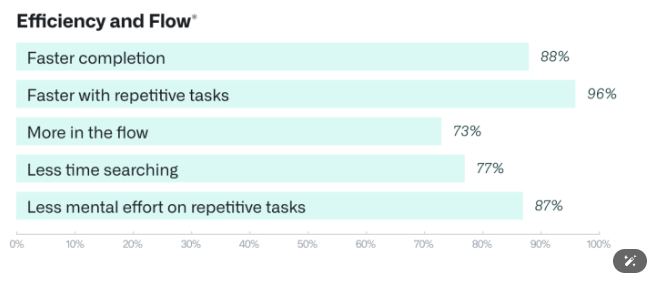

{: width="50%" align="center" style="display: block; margin-left: auto; margin-right:right;"}

---
{: width="60%" align="center" style="display: block; margin-left: auto; margin-right: auto;"}

---

- GitHub Copilot es una herramienta de inteligencia artificial que ayuda a los desarrolladores sugiriendo código, corrigiendo errores y automatizando tareas repetitivas, haciendo el desarrollo más rápido y sencillo. Mejora la productividad, ayuda a los principiantes a aprender y respalda flujos de trabajo eficientes en los equipos. Sin embargo, tiene un impacto ambiental significativo debido al alto consumo de energía necesario para entrenar y ejecutar sus modelos. Para reducir este impacto, se pueden adoptar energías renovables, modelos optimizados, capacidades offline e iniciativas de compensación de carbono.

---

### 💻 Impacto en el sector Desarrollo

- **Aumento de la productividad**:
Herramientas avanzadas como GitHub Copilot han mejorado significativamente la rapidez y eficiencia con la que los desarrolladores pueden escribir código. Además, las metodologías ágiles y el uso de plataformas en la nube han reducido los tiempos de implementación, permitiendo una mejor colaboración y menores barreras entre los equipos, lo que a su vez aumenta la productividad general.

{: width="60%" align="center" style="display: block; margin-left: auto; margin-right: auto;"}

#### 💸 Reducción de costes de desarrollo

- **Computación en la nube**: Reduce costos de infraestructura al alquilar recursos en lugar de mantener servidores propios.

- **Reutilización de código (bibliotecas y marcos de trabajo)**: Permite usar soluciones preexistentes, acelerando el desarrollo y mejorando la calidad del software.

- **Acceso a herramientas de código abierto**: Evita costos de licencias y facilita el uso de herramientas robustas y probadas.

- **Reducción de la necesidad de construir desde cero**: Reutilización de recursos existentes para disminuir el tiempo y esfuerzo de desarrollo.
  
- **Herramientas de automatización**: Minimiza tareas repetitivas, reduciendo costos operativos y acelerando el desarrollo.

{: width="60%" align="center" style="display: block; margin-left: auto; margin-right: auto;"}

---

### 🌍 Impacto ambiental en el sector Desarrollo

- **Consumo energético en el desarrollo de software**:
El desarrollo de software, especialmente con IA y computación en la nube, consume mucha energía debido al uso intensivo de servidores. Plataformas como GitHub requieren grandes cantidades de electricidad para operar, y si la energía proviene de fuentes no renovables, esto contribuye al impacto ambiental. Además, la creciente demanda de hardware potente y la ejecución constante de procesos como compilaciones, pruebas y entrenamiento de IA incrementan aún más la huella de carbono del sector.

- **Generación de residuos electrónicos**:
el crecimiento del desarrollo de la IA, como GitHub Copilot, impulsa la demanda de más hardware, lo que contribuye a los desechos electrónicos y al agotamiento de recursos, al tiempo que aumenta el consumo de energía asociado con la infraestructura necesaria para respaldar estas tecnologías.

---

### 🌱 Propuestas para minimizar los impactos ambientales Desarrollo

#### Desarrollo de software eficiente

- **Optimización de algoritmos**: Mejora la eficiencia y reduce el consumo de recursos y energía.
- **Simplificación del código**: Un código más simple consume menos recursos y es más fácil de mantener.
- **Arquitecturas eficientes**: Minimiza la carga de procesamiento y reduce el consumo de energía.
- **Diseño modular y reutilizable**: Permite reutilizar componentes, ahorrando tiempo y extendiendo el ciclo de vida de las aplicaciones.
- **Reducción del esfuerzo de desarrollo**: Optimiza el uso de recursos y acelera la creación de nuevas funcionalidades.

#### Reciclaje de dispositivos de desarrollo

Promover la reutilización y el reciclaje de dispositivos de desarrollo es clave para reducir los desechos electrónicos. Las empresas pueden implementar programas de reciclaje, ofreciendo incentivos a los empleados para devolver los dispositivos antiguos. Los fabricantes de hardware deben adoptar prácticas sostenibles, utilizando materiales reciclables y diseñando dispositivos más fáciles de reparar y actualizar. Las organizaciones también pueden ayudar donando o reutilizando dispositivos funcionales en lugar de enviarlos a los vertederos.
> ***Nota:** GitHub, Microsoft, Thoughtworks y Accenture lanzaron la Green Software Foundation en 2021 con el objetivo de priorizar la sostenibilidad en el desarrollo de software. Su meta es reducir las emisiones de TIC en un 45% para el año 2030.*
---
{: width="50%" align="center" style="display: block; margin-left: auto; margin-right: auto;"}

[**Índice**](../../README.md){: .btn .btn-primary .float-right}
