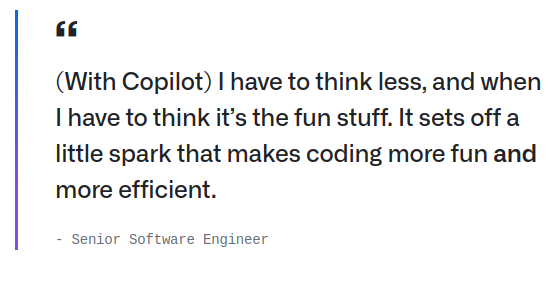

 [**Volver al índice**](../../index.md){: .btn .btn-primary .float-right}
---
{: width="60%" align="center" style="display: block; margin-left: auto; margin-right: auto;"}
---

- GitHub Copilot es una herramienta de inteligencia artificial que ayuda a los desarrolladores sugiriendo código, corrigiendo errores y automatizando tareas repetitivas, haciendo el desarrollo más rápido y sencillo. Mejora la productividad, ayuda a los principiantes a aprender y respalda flujos de trabajo eficientes en los equipos. Sin embargo, tiene un impacto ambiental significativo debido al alto consumo de energía necesario para entrenar y ejecutar sus modelos. Para reducir este impacto, se pueden adoptar energías renovables, modelos optimizados, capacidades offline e iniciativas de compensación de carbono.
---

 ### Impacto en el sector Desarrollo

- **Aumento de la productividad**:
Herramientas avanzadas como GitHub Copilot han mejorado significativamente la rapidez y eficiencia con la que los desarrolladores pueden escribir código. Además, las metodologías ágiles y el uso de plataformas en la nube han reducido los tiempos de implementación, permitiendo una mejor colaboración y menores barreras entre los equipos, lo que a su vez aumenta la productividad general.
 
{: width="60%" align="center" style="display: block; margin-left: auto; margin-right: auto;"}

- **Reducción de costes de desarrollo**:
La computación en la nube, la reutilización de código (a través de bibliotecas y marcos de trabajo), y el acceso a herramientas de código abierto han ayudado a reducir los costos asociados con la infraestructura y el desarrollo. Los desarrolladores pueden aprovechar soluciones existentes, lo que reduce la necesidad de construir todo desde cero. Las herramientas de automatización también reducen la carga de las tareas repetitivas, lo que disminuye los costos operativos y el tiempo de desarrollo.

---
### Impacto ambiental Desarrollo

- **Consumo energético en el desarrollo de software**:
El desarrollo de software, especialmente con el uso de inteligencia artificial, computación en la nube y servidores dedicados para el procesamiento, puede resultar en un alto consumo de energía. Los servidores que alojan plataformas de desarrollo como GitHub pueden consumir grandes cantidades de electricidad, lo que contribuye al impacto ambiental si la energía proviene de fuentes no renovables. La creciente demanda de hardware potente y la ejecución continua de procesos de desarrollo (como compilaciones, pruebas y entrenamiento de IA) aumentan aún más la huella de carbono del sector.

- **Generación de residuos electrónicos**:
el crecimiento del desarrollo de la IA, como GitHub Copilot, impulsa la demanda de más hardware, lo que contribuye a los desechos electrónicos y al agotamiento de recursos, al tiempo que aumenta el consumo de energía asociado con la infraestructura necesaria para respaldar estas tecnologías.
---
### Propuestas para minimizar los impactos ambientales Desarrollo

- **Desarrollo de software eficiente**:
Desarrollar software eficiente no solo mejora el rendimiento de la aplicación, sino que también ayuda a reducir el consumo de recursos. Prácticas como la optimización de algoritmos, la simplificación de la complejidad del código y el uso de arquitecturas que minimizan la carga de procesamiento ayudan a reducir la energía requerida para ejecutar el software. Además, diseñar software modular y reutilizable reduce el esfuerzo de desarrollo y extiende el ciclo de vida de las aplicaciones.

- **Reciclaje de dispositivos de desarrollo**:
Promover la reutilización y el reciclaje de dispositivos de desarrollo es clave para reducir los desechos electrónicos. Las empresas pueden implementar programas de reciclaje, ofreciendo incentivos a los empleados para devolver los dispositivos antiguos. Los fabricantes de hardware deben adoptar prácticas sostenibles, utilizando materiales reciclables y diseñando dispositivos más fáciles de reparar y actualizar. Las organizaciones también pueden ayudar donando o reutilizando dispositivos funcionales en lugar de enviarlos a los vertederos.

{: width="50%" align="center" style="display: block; margin-left: auto; margin-right: auto;"}

[**volver al índice**](../../indice.md){: .btn .btn-primary .float-right}