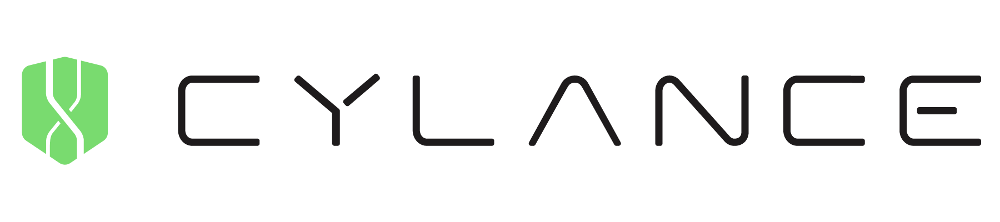

[**Índice**](../../README.md){: .btn .btn-primary .float-right}

{: width="80%" align="center" style="display: block; margin-left: auto; margin-right: auto;"}

**Cylance** es una innovadora solución de ciberseguridad que utiliza **inteligencia artificial (IA)** para prevenir ataques antes de que ocurran, estableciendo un nuevo estándar en la protección de sistemas. A diferencia de las tecnologías tradicionales que dependen de la detección de **firmas conocidas**, Cylance emplea **algoritmos avanzados de aprendizaje automático** para identificar y bloquear amenazas, incluso aquellas inéditas, como ataques **Zero-Day**.  

> **Nota:** Cylance protege sistemas con un enfoque predictivo, lo que permite anticiparse a los riesgos y brindar seguridad eficiente en un entorno de amenazas en constante cambio.

---

## 🚀 **Aplicaciones**

| **Funcionalidad**                            | **Descripción**                                                                                                                                         |
|---------------------------------------------|---------------------------------------------------------------------------------------------------------------------------------------------------------|
| **Prevención de Malware y Zero-Day**         | Detecta y bloquea malware conocido y desconocido **antes** de que se ejecute utilizando **modelos predictivos** y análisis estático de archivos.       |
| **Protección de Endpoints**                 | Salvaguarda dispositivos como laptops, servidores y móviles sin **ralentizar el rendimiento** y operando incluso **sin conexión a la red**.            |
| **Defensa contra Ransomware**               | Identifica y neutraliza procesos de cifrado no autorizados, impidiendo la propagación de ransomware.                                                   |
| **Bloqueo de Amenazas Fileless**            | Monitorea **memoria** y procesos en tiempo real para detener ataques que no dependen de archivos físicos, como inyecciones de código o scripts.        |
| **Resistencia a Técnicas de Evasión**       | Neutraliza malware polimórfico y técnicas avanzadas de ofuscación, analizando las **características fundamentales** de los archivos y vectores de ataque. |

---

## 📊 **Impacto al Sector**

**🔹 Reducción de costos y optimización de recursos:**  
   Automatiza la detección y mitigación de amenazas, minimizando la carga de trabajo de los equipos de TI.  

**🔹 Escalabilidad y eficiencia operativa:**  
   Protege desde **pequeñas empresas** hasta grandes corporaciones, gestionando múltiples dispositivos desde un **único panel de control**.

**🔹 Reducción de dependencia humana:**  
   Disminuye la necesidad de supervisión constante gracias a la **automatización** de respuestas.

**🔹 Adaptación a amenazas en tiempo real:**  
   Responde de manera **inmediata** a nuevas técnicas de ataque emergentes.

**🔹 Mayor cumplimiento normativo:**  
   Facilita la anticipación a **cambios regulatorios** con medidas de seguridad robustas y auditable.

---

## 🌍 **Impacto Ambiental**

> **Advertencia:** El uso de Cylance puede tener un **impacto ambiental significativo**, especialmente debido al **consumo energético** que requieren los servidores y sistemas de alto rendimiento.

El funcionamiento continuo de estos servidores supone:  

- **Consumo energético elevado**, con emisiones de CO₂ si proviene de fuentes **no renovables**.  

- **Generación de residuos electrónicos**, acelerada por el desgaste del hardware.  

Si no se gestiona adecuadamente, estos factores pueden **contaminar** el suelo y el agua, contribuyendo al **cambio climático**.

---

## 🌱 **Propuestas para Minimizar el Impacto Ambiental**

Para optimizar el funcionamiento de Cylance y **reducir su impacto ambiental**, se pueden implementar las siguientes medidas sostenibles:

- **Energías Renovables:**  
  Migrar los servidores a centros de datos que operen con **energía solar, eólica o hidroeléctrica**, reduciendo significativamente las **emisiones de CO₂**.

- **Optimización de Algoritmos:**  
  Mejorar los algoritmos de IA para que consuman **menos energía** durante el análisis y entrenamiento, optimizando recursos.

- **Refrigeración Ecológica:**  
  Implementar sistemas de **refrigeración pasiva** o tecnologías más eficientes para minimizar el gasto energético de los centros de datos.

- **Reutilización de Hardware:**  
  Fomentar la **reutilización y reciclaje** de equipos electrónicos, reduciendo la generación de residuos y prolongando la vida útil del hardware.

- **Monitorización en Tiempo Real:**  
  Implementar sistemas para **medir y controlar el consumo energético** de manera constante, identificando y corrigiendo usos ineficientes.

> **Resultado esperado:** Estas acciones lograrán un uso más **eficiente y sostenible** de Cylance, equilibrando innovación tecnológica y respeto al medio ambiente.

---

### 🌟 **Conclusión**  

Cylance ofrece una solución **potente y predictiva** para la ciberseguridad moderna, pero su uso debe alinearse con prácticas sostenibles para minimizar su **impacto ambiental**. Implementar energías renovables, optimizar algoritmos y fomentar el reciclaje son claves para un futuro tecnológico más **responsable**.

---

## 📚 **Recursos Adicionales**

Si deseas obtener más información sobre Cylance y su impacto en la ciberseguridad y el medio ambiente, te recomendamos revisar los siguientes recursos:

- [Página oficial de Cylance](https://www.cylance.com/)
- [Informe sobre el impacto ambiental de la ciberseguridad](https://www.cylance.com/content/dam/cylance-web/en-us/resources/white-papers/cylance-whitepaper-environmental-impact.pdf)
- [Artículo sobre la importancia de la sostenibilidad en la industria tecnológica](https://www.cylance.com/en-us/blog/sustainability-in-the-tech-industry.html)

Estos recursos te brindarán una visión más completa sobre Cylance y cómo puedes contribuir a un uso responsable de esta solución de ciberseguridad.

{: width="35%" align="center" style="display: block; margin-left: auto; margin-right: auto; margin-top: 5%"}

---

[**Índice**](../../README.md){: .btn .btn-primary .float-right}  
