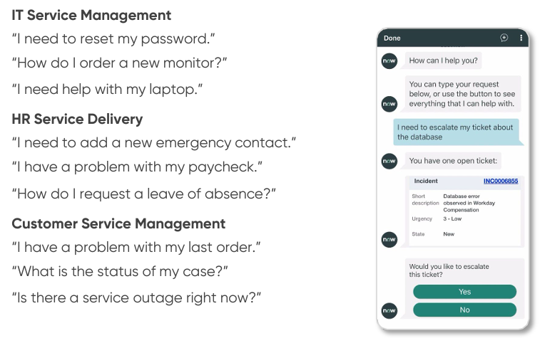

[**Índice**](../../README.md){: .btn .btn-primary .float-right}

# Soporte Técnico

Los chatbots y asistentes virtuales impulsados ​​por IA pueden brindar soporte al cliente las 24 horas, los 7 días de la semana, manejar múltiples consultas simultáneamente y brindar experiencias personalizadas al cliente. Actualmente encontramos dos tipos de IA usadas en el soporte técnico hacia los clientes de la industria:

**IA para la atención al cliente:** los chatbots y asistentes virtuales con tecnología de IA pueden brindar soporte al cliente las 24 horas, los 7 días de la semana, manejar múltiples consultas simultáneamente y brindar experiencias personalizadas al cliente.

**IA para la gestión de servicios:** la IA puede mejorar la gestión de servicios de IT (ITSM) al automatizar tareas rutinarias y brindar información inteligente. Por ejemplo, los chatbots con tecnología de IA pueden manejar consultas rutinarias de los clientes, lo que libera a los agentes del helpdesk para que se concentren en problemas más complejos. El análisis predictivo puede ayudar a anticipar problemas, crear alertas para el cliente y automatizar respuestas, lo que mejora la calidad del servicio y la satisfacción del cliente.

{: width="100%" align="center" style="display: block; margin-left: auto; margin-right: auto;"}

**ServiceNow** es una plataforma en la nube que ofrece soluciones para la gestión de servicios de soporte técnico (ITSM, por sus siglas en inglés: IT Service Management). Está diseñada para automatizar y optimizar procesos empresariales y de TI, proporcionando una única plataforma que conecta todos los departamentos y flujos de trabajo dentro de una organización.

Originalmente centrada en la gestión de servicios de TI, ServiceNow se ha expandido para cubrir una amplia gama de áreas empresariales, como la gestión de recursos humanos (HR), la gestión de operaciones empresariales (ITOM), la gestión de seguridad (SecOps), el soporte al cliente (CSM), la gestión de proyectos, entre otros.
Permite a los usuarios realizar solicitudes de servicios (como la provisión de hardware o software) o crear incidencias para reportar malfuncionamiento de aplicaciones y hacer un seguimiento de su estado.

**ServiceNow Virtual Agent**  es una plataforma de chatbots basada en inteligencia artificial (IA) que se integra dentro del ecosistema de ServiceNow. El Virtual Agent de ServiceNow es una herramienta potente para empresas que buscan mejorar la atención al cliente, reducir el tiempo de respuesta, y liberar a sus empleados de tareas repetitivas, enfocándose en problemas más complejos que requieren intervención humana.
Además Copilot.Live puede ser integrado para optimizar el chatbot de ServiceNow.

{: width="100%" align="center" style="display: block; margin-left: auto; margin-right: auto;"}

## Aplicaciones

- **Respuesta automáticas basadas en árticulos existentes**: puede responder preguntas frecuentes de los usuarios relacionadas con productos, servicios o problemas técnicos sin intervención humana. Por ejemplo, puede gestionar solicitudes de soporte relacionadas con contraseñas, incidencias técnicas o problemas con aplicaciones.
- **Creación y gestión de incidencias**: crea tickets automáticamente en sistemas de gestión de incidentes y solicitudes cuando un usuario reporta un problema. También puede asignar tareas y hacer seguimientos sin intervención manual.
- **Gestión de cambios y configuraciones**: creación y seguimiento de solicitudes de cambios en infraestructuras tecnológicas o configuraciones de sistemas, ayudando a automatizar tareas rutinarias de administración de TI.
- **Disponible 24/7 y personalización de respuestas**: Utiliza aprendizaje automático y procesamiento de lenguaje natural (NLP) para personalizar las interacciones y ofrecer respuestas más precisas y útiles. Además está disponible 24/7, por lo tanto puede crear incidencias y resolverlas.

## Impacto al sector

- **Millora de la seguretat**:
- **Reducció de les amenaces cibernètiques**:
- **Automatització de processos de seguretat**:

## Impacto ambiental

- **Costos energètics**:
- **Generació de CO2**:

## Propuestas para minimizar el impacto ambiental

- **Optimització d'algorismes**:

[**Índice**](../../README.md){: .btn .btn-primary .float-right}