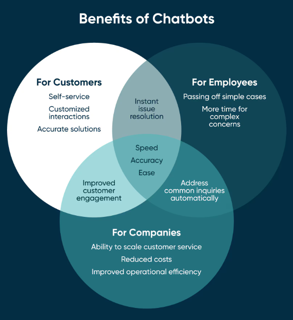
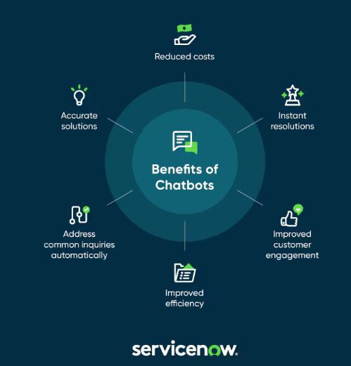
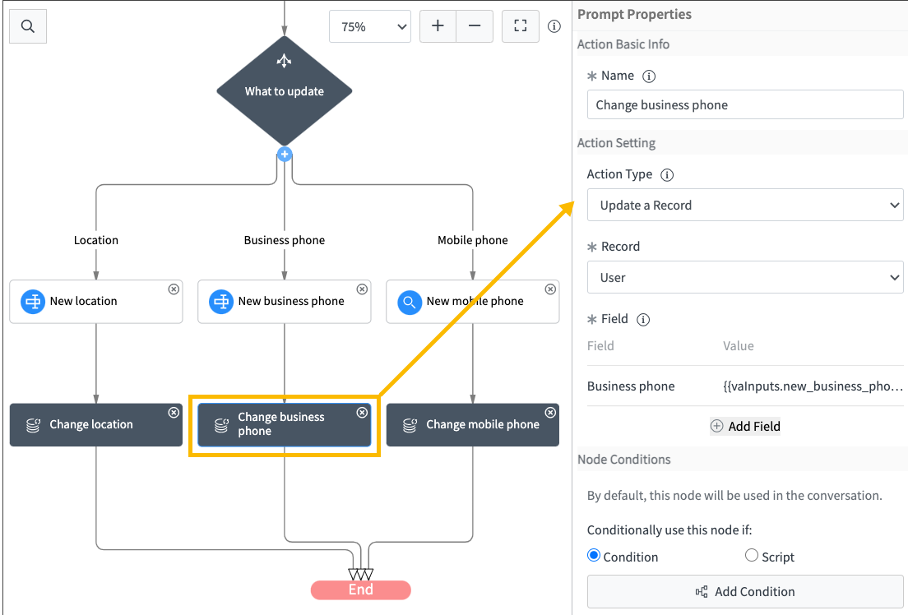

# 🤖💬 Soporte Técnico 🤖💬

{: width="100%" align="center" style="display: block; margin-left: auto; margin-right: auto;"}

Los chatbots y asistentes virtuales impulsados ​​por IA pueden brindar soporte al cliente las 24 horas, los 7 días de la semana, manejar múltiples consultas simultáneamente y brindar experiencias personalizadas al cliente. Actualmente encontramos dos tipos de IA usadas en el soporte técnico hacia los clientes de la industria:

**IA para la atención al cliente:** los chatbots y asistentes virtuales con tecnología de IA pueden brindar soporte al cliente las 24 horas, los 7 días de la semana, manejar múltiples consultas simultáneamente y brindar experiencias personalizadas al cliente.

**IA para la gestión de servicios:** la IA puede mejorar la gestión de servicios de IT (ITSM) al automatizar tareas rutinarias y brindar información inteligente. Por ejemplo, los chatbots con tecnología de IA pueden manejar consultas rutinarias de los clientes, lo que libera a los agentes del helpdesk para que se concentren en problemas más complejos. El análisis predictivo puede ayudar a anticipar problemas, crear alertas para el cliente y automatizar respuestas, lo que mejora la calidad del servicio y la satisfacción del cliente.

---
> *“La IA es una de las cosas más importantes en las que la humanidad está trabajando. Es más profunda que, creo, el fuego o la electricidad.” Sundar Pichai (CEO de Google).*
---

**ServiceNow** es una plataforma en la nube que ofrece soluciones para la gestión de servicios de soporte técnico (ITSM, por sus siglas en inglés: IT Service Management). Está diseñada para automatizar y optimizar procesos empresariales y de *TI*, proporcionando una única plataforma que conecta todos los departamentos y flujos de trabajo dentro de una organización.

Originalmente centrada en la gestión de servicios de TI, ServiceNow se ha expandido para cubrir una amplia gama de áreas empresariales, como la gestión de recursos humanos (HR), la gestión de operaciones empresariales (ITOM), la gestión de seguridad (SecOps), el soporte al cliente (CSM), la gestión de proyectos, entre otros.
Permite a los usuarios realizar solicitudes de servicios (como la provisión de hardware o software) o crear incidencias para reportar malfuncionamiento de aplicaciones y hacer un seguimiento de su estado.

{: width="80%" align="center" style="display: block; margin-left: auto; margin-right: auto;"}

**ServiceNow Virtual Agent**  es una plataforma de chatbots basada en inteligencia artificial que se integra dentro del ecosistema de ServiceNow. El *Virtual Agent de ServiceNow* es una herramienta potente para empresas que buscan mejorar la atención al cliente, reducir el tiempo de respuesta, y liberar a sus empleados de tareas repetitivas, enfocándose en problemas más complejos que requieren intervención humana.

<iframe width="560" height="315" src='//players.brightcove.net/5703385908001/default_default/index.html?videoId=6249212996001' frameborder=0 allow="accelerometer; autoplay; encrypted-media; gyroscope; picture-in-picture" allowfullscreen></iframe>

## 📞 Aplicaciones 💬

- **📄 Respuesta automáticas basadas en árticulos existentes**: puede responder preguntas frecuentes de los usuarios relacionadas con productos, servicios o problemas técnicos sin intervención humana. Por ejemplo, puede gestionar solicitudes de soporte relacionadas con contraseñas, incidencias técnicas o problemas con aplicaciones.

- **📋 Creación y gestión de incidencias**: crea tickets automáticamente en sistemas de gestión de incidentes y solicitudes cuando un usuario reporta un problema. También puede asignar tareas y hacer seguimientos sin intervención manual.

- **⚙️ Gestión de cambios y configuraciones**: creación y seguimiento de solicitudes de cambios en infraestructuras tecnológicas o configuraciones de sistemas, ayudando a automatizar tareas rutinarias de administración de TI.

- **📆 Disponible 24/7 y personalización de respuestas**: utiliza aprendizaje automático y procesamiento de lenguaje natural (NLP) para personalizar las interacciones y ofrecer respuestas más precisas y útiles. Además está disponible 24/7, por lo tanto puede crear incidencias y resolverlas.

- **🛠️ Resolución de incidencias**: es capaz de resolver de problemas comunes de TI, como restablecimiento de contraseñas o problemas con el hardware.

- **🤝 Atención al cliente**: ofrece respuestas rápidas a consultas frecuentes, reduciendo la carga sobre los trabajadores encargados de estas tareas.

{: width="100%" align="center" style="display: block; margin-left: auto; margin-right: auto;"}

## 🔍 Impacto en el sector 🚀

- **📞 Reducción del volumen de llamadas**: al desviar problemas comunes a un chatbot, se reduce la cantidad de llamadas entrantes. Así mejora el tiempo de respuesta y al optimizar dichas contestaciones, los agentes de soporte atienden los incidentes y resuelven los problemas con mayor rapidez dedicando tiempo a lo realmente urgente.

- **🕒 Aumento de la productividad**: los efectivos que se dedican a resolver incidencias pueden centrarse en tareas más compleas y urgentes.

- **🏆 Mejora de la experiencia del usuario**: resoluciones rápidas y precisas aumentan la satisfacción tanto de empleados como de clientes. También pueden reducir la cantidad de errores humanos en el soporte técnico, lo que puede llevar a una reducción en los costes asociados con la corrección de errores.

- **📝 Mantenimiento de la base de conocimiento**: al convertir las resoluciones de los incidentes en borradores, acelera el proceso de creación de artículos de la base de conocimiento lo que garantiza que esté actualizada y conserve toda la información, incluso si se marchan los miembros experimentados del equipo.
---

{: width="80%" align="center" style="display: block; margin-left: auto; margin-right: auto;"}

## 🏭 Impacto ambiental 🚗💨
### 1. Consumo energético:

* **Infraestructura en la nube**: Los sistemas como ServiceNow Virtual Agent suelen funcionar en servidores ubicados en centros de datos que requieren grandes cantidades de energía para mantener sus servidores en funcionamiento y, en muchos casos, esa energía proviene de fuentes no renovables.

* **Procesamiento de IA**: Los modelos de inteligencia artificial, como los utilizados en los asistentes virtuales, requieren un procesamiento intensivo de datos, lo que puede consumir una cantidad significativa de energía, especialmente si se utilizan grandes volúmenes de datos y se entrenan modelos complejos.

### 2. Emisiones de carbono: 
El consumo de energía, especialmente si proviene de fuentes fósiles, contribuye a las emisiones de gases de efecto invernadero. Si los servidores que ejecutan los agentes virtuales no están alimentados por fuentes de energía renovables, el uso continuo de estos servicios puede aumentar la huella de carbono de una organización.

### 3. Fabricación de hardware: 
Para soportar plataformas de IA y la infraestructura en la nube, se fabrican servidores, dispositivos de almacenamiento y otros componentes tecnológicos. La fabricación de estos dispositivos requiere recursos naturales y energía, y su producción y transporte tienen un impacto ambiental.

### 4. Obsolescencia y desecho de equipos: 
A medida que la tecnología avanza, los equipos que alojan los sistemas virtuales pueden volverse obsoletos y ser reemplazados. Esto genera desechos electrónicos, los cuales pueden no ser reciclados de manera adecuada, lo que puede causar contaminación del suelo y el agua si no se gestionan correctamente.

<iframe width="410" height="730" src="https://www.youtube.com/embed/XZBbCAIZZog" title="Inteligencia artificial: el costo climático oculto" frameborder="0" allow="accelerometer; autoplay; clipboard-write; encrypted-media; gyroscope; picture-in-picture; web-share" referrerpolicy="strict-origin-when-cross-origin" allowfullscreen></iframe>

---

## ♻️ Propuestas para minimizar el impacto ambiental 🌍

- 🔄 **Optimitzación de la Infraestructura**: Se pueden usar centros de datos sostenibles y así nos aseguramos de que los servidores que alojan ServiceNow utilicen energía renovable y tengan certificaciones verdes como LEED o ISO 14001.
También podemos optimizar el uso de recursos mediante la virtualización y la tecnología en la nube que permite escalar según la demanda, reduciendo el consumo de energía en periodos de baja actividad.

- 🔧 **Desarrollo y Mejora del Software**: nos podemos asegurar del que el código de Virtual Agent esté optimizado para consumir la menor cantidad de recursos posibles. También podemos realizar mantenimientos regulares y actualizaciones para garantizar que el software funcione de manera eficiente y no consuma recursos innecesarios.

- 🔁 **Programas de reciclaje y economía circular**: podemos establecer programas de reciclaje y reutilización que recojan y procesen los equipos obsoletos de manera adecuada para recuperar materiales valiosos y reducir los desechos. También podemos promover la reparación, reutilización y reciclaje de equipos electrónicos en lugar de desecharlos además de implementar y hacer cumplir regulaciones estrictas sobre la gestión de desechos electrónicos para garantizar que los equipos se reciclen de manera segura y responsable.

- 🎨 **Inversión en diseño y fabricación**:se puede invertir en el diseño de equipos con componentes modulares con mayor durabilidad, más eficientes y menos intensivos en energía que puedan ser fácilmente reemplazados o actualizados sin necesidad de desechar el dispositivo completo. Por otro lado, se puede fomentar el uso de materiales reciclados y reciclables en la fabricación de hardware para reducir la demanda de nuevos recursos naturales.

- 📈 **Monitoreo y Evaluación**: podemos realizar auditorías periódicas para evaluar el impacto ambiental de las operaciones y el uso del Virtual Agent.
además de establecer indicadores clave de rendimiento (KPIs) específicos para monitorear la huella de carbono y así poder reducirla.

---

{: width="80%" align="center" style="display: block; margin-left: auto; margin-right: auto;"}

*Si quieres saber más sobre esta IA sobre soporte técnico, dirígete [aquí](https://www.servicenow.com/es/standard/resource-center/data-sheet/ds-virtual-agent.html).*

## Curiosidades

1. Si quisieramos crear un script de Javascript que nos dijera el estado de la incidencia sería así. 
~~~
(function execute(inputs, outputs) {
    var incidentNumber = inputs.incidentNumber || "";
    var incidentGR = new GlideRecord('incident');
    incidentGR.addQuery('number', incidentNumber);
    incidentGR.query();

    if (incidentGR.next()) {
        outputs.response = "El estado de tu incidencia " + incidentNumber + " es: " + incidentGR.state.getDisplayValue();
    } else {
        outputs.response = "No se encontró la incidencia con el número especificado.";
    }
})(inputs, outputs);
~~~

2. Si tuvieramos que crear una conversación para restablecer contraseña

~~~
(function execute(inputs, outputs) {
    var userId = inputs.userId || ""; // ID de usuario desde la entrada
    var userGR = new GlideRecord('sys_user');
    userGR.get(userId);
    
    if (userGR.isValidRecord()) {
        // Aquí iría la lógica para restablecer la contraseña
        outputs.response = "Hola " + userGR.getValue('name') + ", estamos restableciendo tu contraseña.";
        // Lógica adicional para restablecimiento de contraseña
    } else {
        outputs.response = "No se encontró el usuario especificado.";
    }
})(inputs, outputs);
~~~

{: width="80%" align="center" style="display: block; margin-left: auto; margin-right: auto;"}

*Diagrama de diseño de actualización de teléfono de oficina en ServiceNow Virtual Agent.*

---
## Webgrafía

[Herramientas de Soporte Técnico con IA](https://blog.invgate.com/es/herramientas-de-soporte-tecnico-con-ia)

[Beneficios de ServiceNow Virtual Agent](https://www.servicenow.com/es/products/virtual-agent.html#benefits)

[Data Sheet ServiceNow Virtual Agent](https://www.servicenow.com/es/standard/resource-center/data-sheet/ds-virtual-agent.html)

[Integrar Copilot en ServiceNow](https://www.copilot.live/es/usecase/chatbot-servicenow)

[¿Cómo desarrollar ServiceNow Virtual Agent?](https://developer.servicenow.com/dev.do?_escaped_fragment_=/learn/courses/xanadu/app_store_learnv2_virtualagent_xanadu_virtual_agent/app_store_learnv2_virtualagent_xanadu_developing_virtual_agent_topics/app_store_learnv2_virtualagent_xanadu_creating_and_updating_records)

---

[⬆️**Índice**](../../README.md){: .btn .btn-primary .float-right}

