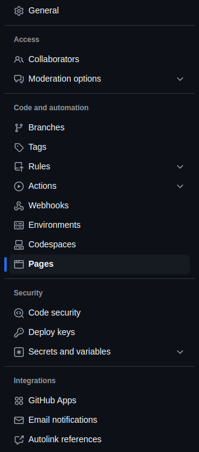
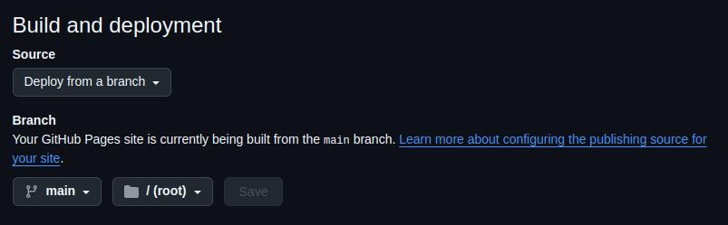
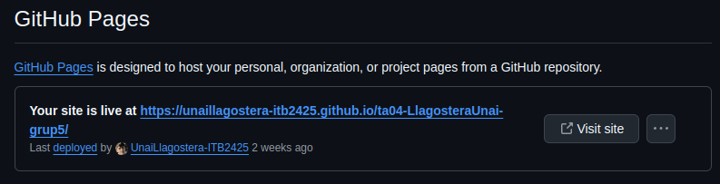
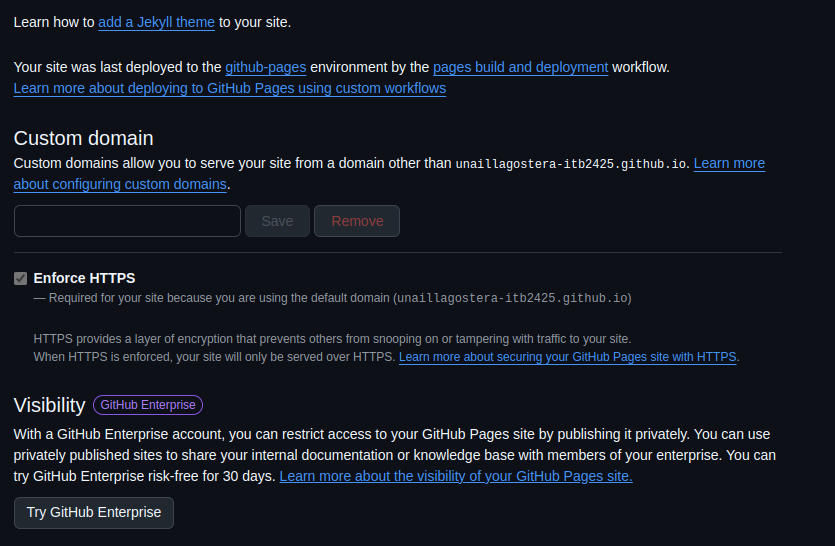

{: width="1000%" align="center" style="display: block; margin-left: auto; margin-right: auto;"}

## Utilidad y funciones

GitHub Pages es una herramienta gratuita que permite a los usuarios alojar sitios web estáticos directamente desde sus repositorios en GitHub. Está diseñada para facilitar la publicación de contenido web sencillo, como páginas HTML, CSS, JavaScript y otros archivos relacionados como en este caso MarkDown. Su principal ventaja es la facilidad de uso, ya que basta con crear un repositorio y seleccionar una rama específica para que el sitio web se publique automáticamente. Además, GitHub Pages se integra perfectamente con el flujo de trabajo de Git, permitiendo que los cambios realizados en el repositorio se reflejen fácilmente en el sitio. Aunque GitHub Pages ofrece un subdominio gratuito (por ejemplo, `usuario.github.io`), también permite usar un dominio personalizado. En resumen, GitHub Pages es una herramienta poderosa y accesible para aquellos que desean publicar sitios web estáticos de manera rápida, sencilla y sin coste alguno.

> **⚠️ Advertencia:** GitHub pages tiene **totalmente prohibido** su uso para fines lucrativos.

## 📝 Requisitos

Para poder publicar en pages necesitamos de un usuario en Github, luego tendriamos que crear el repositorio que nos gustaría publicar, dicho repositorio tiene que contener codigo el cual contenga un estructura soportada por el sistema de GitHub, como por ejemplo HTML, CSS... Después en la raiz /ROOT ha de contener como mínimo un archivo que hará la función de index.

## 👣 Pasos de publicación

**1.** Para empezar entra en la sección de configuración de tu repositorio.
{: width="1000%" align="center" style="display: block; margin-left: auto; margin-right: auto; margin-top:20px;"}
**2.** A continuación acceda al apartado de pages.
{: width="60%" align="center" style="display: block; margin-left: auto; margin-right: auto; margin-top:20px;"}
**3.** En este punto podremos visualizar el siguiente menu:
{: width="60%" align="center" style="display: block; margin-left: auto; margin-right: auto;}
Debemos seleccionar deploy from a branch y de forma predeterminada dejarlo en la branch main en la carpeta del root (la general). Se recomiendo almacenar todos los archivos dentro de otra carpeta anomenada src y fuera de esta un index/readme que sirva para presentar la web.
{: width="60%" align="center" style="display: block; margin-left: auto; margin-right: auto;}

## ✅ Verificación

Para poder verificar que tu pagina se haya publicado correctamente simplemente necesitas esperar unos minutos, en el apartado donde publicamos nuestro repositorio anteriormente se mostrará el siguiente popup con un enlace el cual te redirigirá a tu página web.
{: width="1000%" align="center" style="display: block; margin-left: auto; margin-right: auto; margin-top:20px;"}
Una vez se haya generado el enlace al pulsarlo te enviaría a tu nueva pagina, la cual contendra la información que hayas introducido en el en los archivos del respositorio que hayas publicado, siempre y cuando esten todos los datos correctos.

## Extras

Aquí explicaremos algunas funciones adicionales de GitHub pages.

{: width="1000%" align="center" style="display: block; margin-left: auto; margin-right: auto; margin-top: 1px;"}

🔹 **Custom Domain:** GitHub aparte de darnos un dominio para nuestra página web. nos ofrece la opción de añadir un dominio personalizado.

🔹 **Enforce HTTPS:** Esta opción asegura que tu sitio web se sirva siempre mediante HTTPS, un protocolo de seguridad que cifra la información entre el navegador del usuario y el servidor. GitHub recomienda habilitar esta opción, ya que garantiza que tu sitio sea accesible solo a través de HTTPS, asegurando así una mayor privacidad y seguridad para los usuarios que lo visitan.

🔹 **Visibility:** Esta función está disponible para usuarios de GitHub Enterprise, que es una versión de GitHub orientada a organizaciones y equipos privados. Cuando publicas un sitio de GitHub Pages en un entorno de GitHub Enterprise, puedes elegir mantener el acceso al sitio restringido y publicarlo de manera privada. Esto es útil si deseas compartir documentación interna, bases de conocimiento o recursos exclusivos para los miembros de tu empresa, sin que sean accesibles al público en general. Puedes controlar quién puede ver el sitio dentro de tu organización.

---

[**Índice**](../../README.md){: .btn .btn-primary .float-right}
