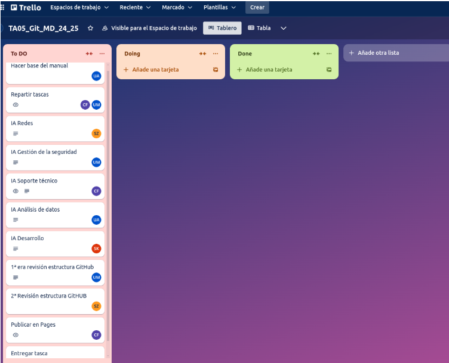
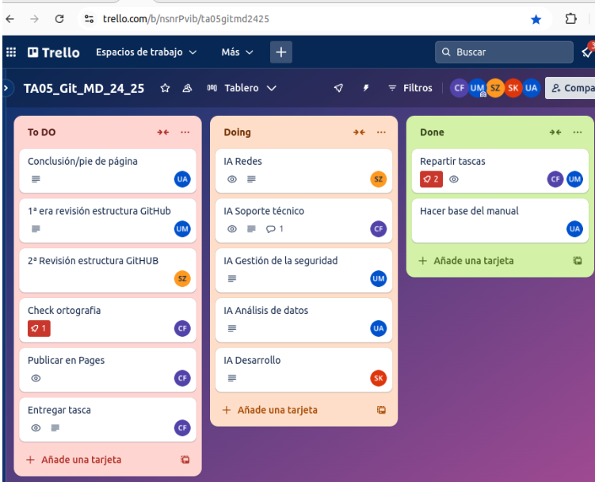
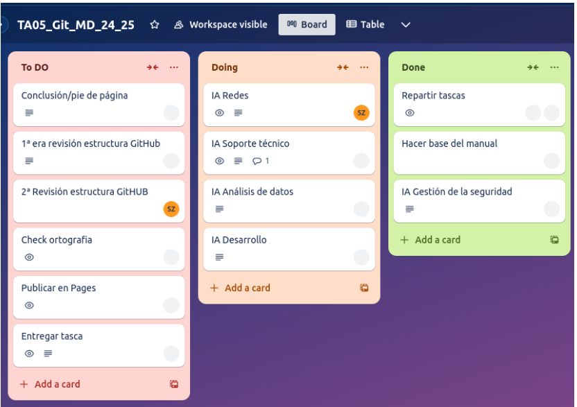
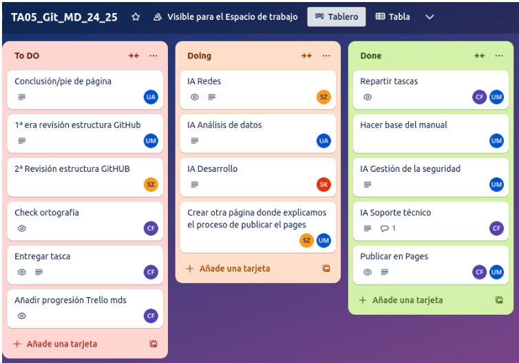
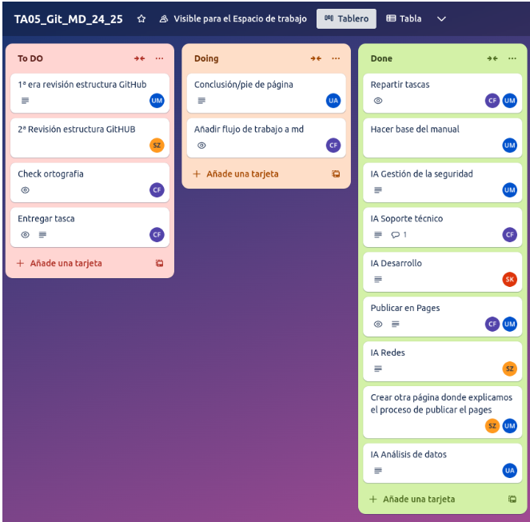
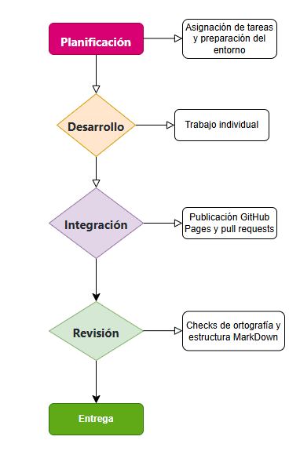

# Flujo de trabajo del Proyecto Manual sobre IA en ASIX con MarkDown y GitHub

## 1. Introducción
Hemos desarrollado y publicado un manual colaborativo en GitHub sobre diversas herramientas y aplicaciones de inteligencia artificial (IA) aplicadas a la administración de sistemas informáticos. 

## Resumen de las IA

| **Inteligencia Artificial**| **Descripción**|
|---------------------------------------------|---------------------------------------------------------------------------------------------------------------------------------------------------------|
| **Github Copilot**         | GitHub Copilot es una herramienta de inteligencia artificial que ayuda a los desarrolladores sugiriendo código, corrigiendo errores y automatizando tareas repetitivas, haciendo el desarrollo más rápido y sencillo. Mejora la productividad, ayuda a los principiantes a aprender y respalda flujos de trabajo eficientes en los equipos.        |
| **Microsoft Azure**                 | Microsoft Azure AI es una plataforma robusta y flexible que pone el poder de la inteligencia artificial al alcance de las empresas. Con una amplia gama de servicios de IA, desde herramientas preconfiguradas hasta capacidades avanzadas para desarrollar modelos personalizados, Azure AI facilita la integración de la inteligencia artificial en soluciones empresariales, mejorando la eficiencia, la toma de decisiones y la innovación en distintos sectores.            |
| **Cylance**               | Cylance es una innovadora solución de ciberseguridad que utiliza inteligencia artificial (IA) para prevenir ataques antes de que ocurran, estableciendo un nuevo estándar en la protección de sistemas. A diferencia de las tecnologías tradicionales que dependen de la detección de firmas conocidas, Cylance emplea algoritmos avanzados de aprendizaje automático para identificar y bloquear amenazas, incluso aquellas inéditas, como ataques Zero-Day.                                                   |
| **Juniper Network**            | Juniper Networks aprovecha la inteligencia artificial para hacer sus soluciones de red más inteligentes, seguras y eficientes, proporcionando una experiencia más fluida tanto para los administradores de TI como para los usuarios finales.        |
| **ServiceNow Virtual Agent**       | ServiceNow Virtual Agent es una plataforma de chatbots basada en inteligencia artificial que se integra dentro del ecosistema de ServiceNow. El Virtual Agent de ServiceNow es una herramienta potente para empresas que buscan mejorar la atención al cliente, reducir el tiempo de respuesta, y liberar a sus empleados de tareas repetitivas, enfocándose en problemas más complejos que requieren intervención humana.

## 2. Equipo de Proyecto

| Rol | Nombre | Contacto | 
|---------------------|----------------|--------------------| 
| Líder| Carolina Jiménez | carolina.jimenez.7e8@itb.cat | 
| Desarrollador | Unai Almarcha | unai.almarcha.7e8@itb.cat  | 
| Desarrollador | Unai Llagostera | unai.llagostera.7e8@itb.cat  |
| Desarrollador | Spandan Khadka| spandan.khadka.7e8@itb.cat |
| Desarrollador | Samuel Moscoso| samuel.moscoso.7e8@itb.cat |

## 3. Herramientas utilizadas:
Lista de herramientas y tecnologías utilizadas en el proyecto. 
- **Lenguajes de programación**: Markdown
- **Plataformas**: GitHub
- **Herramientas de gestión**: Trello

## 4. Flujo de Trabajo

### 4.1. Planificación
1. **Reuniones Iniciales**: Primero definimos los puntos clave requeridos para este proyecto.
2. **Asignación de Tareas**: Una vez definidos distribuimos y registramos los roles y las responsabilidades a través la herramienta Trello.

> Pantallazo Trello 2 de Diciembre 2024. El primer día decidimos las tascas principales y las repartimos entre los miembros del grupo.

{: width="80%" align="center" style="display: block; margin-left: auto; margin-right: auto;"}

### 4.2. Desarrollo
1. **Configuración del Entorno**: Unai Llagostera se encargó de la creación de las carpetas y de la base del manual después de que Carolina creara el repositorio en GitHub y las ramas asignadas a cada uno de los integrantes del equipo. Una vez realizada esta parte las herramientas y el entorno de desarrollo estaban configurados.

> Pantallazo Trello 3 de Diciembre 2024. El segundo día ya empezamos con el trabajo individual cada uno en su branch.

{: width="80%" align="center" style="display: block; margin-left: auto; margin-right: auto;"}

2. **Investigación y Recolección de Información**: Recopilamos datos sobre la herramienta y aplicaciones de IA relevantes dentro del sector que cada uno tenía asignado.
3. **Redacción de Contenido**: empezamos a redactar el contenido del manual en Markdown.

> Pantallazo Trello 9 de Diciembre 2024. Empezamos a terminar la redacción de contenido que estábamos llevando a cabo de manera individual.

{: width="80%" align="center" style="display: block; margin-left: auto; margin-right: auto;"}

### 4.3. Integración
1. **Preparación del Entorno de Producción**: Hicimos varias pull request, después investigamos cómo publicar nuestro proyecto en GitHub Pages.

2. **Despliegue**: Una vez publicado nuestro proyecto en GitHub Pages decidimos qué cambios implementaríamos. Uno de los cambios más decisivos fue si era realmente necesario introducir un botón que llevara al inicio ya que el propio título del proyecto nos proporcionaba el mismo funcionamiento.
3. **Actualización de la Documentación del proyecto**: Actualizamos las tareas que teníamos asignadas en Trello y redifinimos cómo entregaríamos el proyecto. De tal forma que decidimos crear dos páginas suplementarias que explicaran cómo realizamos la publicación de este proyecto en Pages y el flujo de trabajo de este proyecto.
4. **Integración de Contenido**: Integramos las contribuciones individuales que cada uno había hecho en su propia rama en la rama main del repositorio de GitHub.

> Pantallazo Trello 10 de Diciembre 2024. En este paso también nos dimos cuenta de que había que añadir algunas funcionalidades más por eso añadimos tareas como añadir progresión Trello en markdown, la conclusión/pie de página que sería añadida también a la misma página.También integramos los cambios individuales a la rama main.

{: width="80%" align="center" style="display: block; margin-left: auto; margin-right: auto;"}

### 4.4. Revisión

> Pantallazo Trello 16 de Diciembre 2024. La mayoría de las tareas ya han sido realizadas y solo nos quedaban las últimas revisiones y los últimos detalles.

{: width="80%" align="center" style="display: block; margin-left: auto; margin-right: auto;"}

1. **Integración de Contenido**: Volvimos a integrar las contribuciones individuales haciendo varias pull request.
2. **Feedback y Correcciones**: Volvimos a reunirnos para dar feedback, incorporamos el feedback recibido y realizamos las correcciones necesarias.

### 4.5. Entrega 
Entrega realizada después de haber revisado y hecho las modificaciones correspondientes en todo el proyecto.

## 5. Diagrama de Flujo
A continuación se detalla de manera esquematizada el flujo de trabajo que hemos seguido en este proyecto.

{: width="80%" align="center" style="display: block; margin-left: auto; margin-right: auto;"}

## 6. Conclusión
El manual colaborativo es un recurso que no se actualizará continuamente para incluir las últimas herramientas y aplicaciones de IA aplicadas a la administración de sistemas informáticos ya que se trata de un proyecto con fines educativos para practicar el uso de MarkDown y GitHub. Por lo tanto, puede que en algunos meses la información añadida quede de alguna forma obsoleta.

## 7. Referencias
- [Trello](https://trello.com/invite/b/674d618a7f62b41f604378c7/ATTIb3e7e5efbdf658c3bc2dabbc6c33974a4DDEF8A7/ta05gitmd2425)
- [GitHub](https://docs.github.com/en)
- [Funcionalidades de MarkDown](https://www.youtube.com/watch?v=qhoXn4bIE1s&ab_channel=JamesBachini)

[**Índice**](../../README.md){: .btn .btn-primary .float-right}
